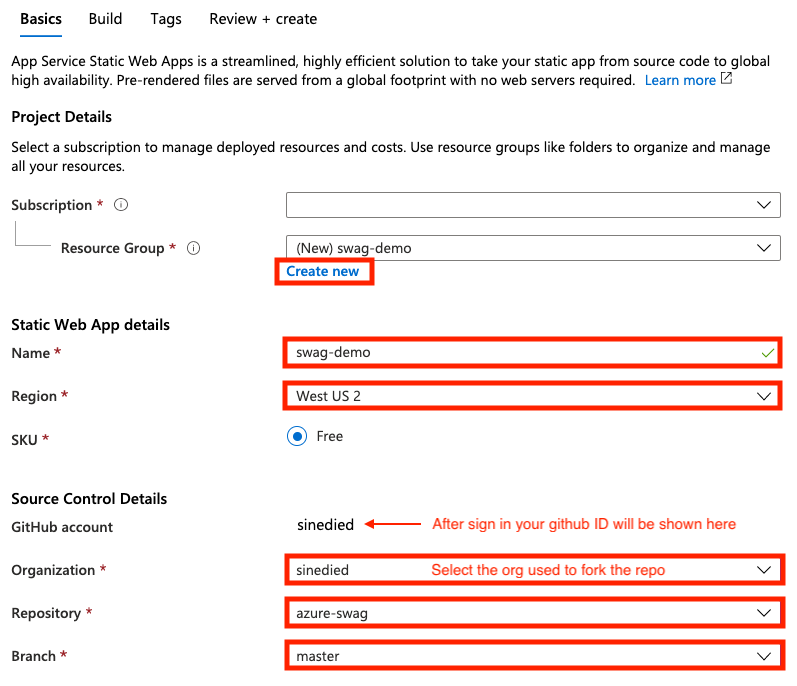
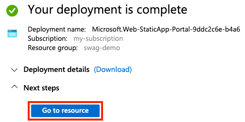

# The easy way to serverless web apps and APIs with Azure SWAG

What's this new Azure *SWAG* thing?

During last week [Build 2020 conference](https://mybuild.microsoft.com), the new Azure **S**tatic **W**eb **A**pps service has just been unveiled. And it works with **G**itHub repositories. So for short, Azure **SWAG** 😎. But what is it about?

#### Short version

> It's an all-inclusive hosting service for web apps with serverless APIs, based on continuous deployment from a GitHub repository.

Boom.

#### Slightly longer version

With a quick one-time setup you can deploy any web app, be it a SPA or a static website:

- Using React, Vue, Angular, or Svelte? You're covered ✅.
- Using Gatsby.js, Vuepress, Hugo, Jekyll or static website generator? You're covered too ✅.
- Want to go further and do SSR? Works too ✅.

If you need to crunch some data, you also get a serverless API alongside your web app, based on [Functions](https://docs.microsoft.com/azure/azure-functions/functions-overview). You put your API code on the same repo as your web app, and it will be deployed at the same way with no extra efforts.

Oh, and did I mention that it also comes with a built-in Identity manager service? You can add authentication with differents roles for your users at the hand of a JSON configuration file.

I'm really excited about this new service because my previous web development experience with Azure was far from smooth sailing... Let's be completely honest here: it felt way over-complicated for a developer just wanting to deploy a web app with an API.

With this new [Static Web Apps](https://docs.microsoft.com/azure/static-web-apps?WT.mc_id=staticwebapps-blog-yolasors) all-in-one solution, it's kind of a relief and feels to me like a welcome gift for us web developer. And by gift, I really mean it as it comes with a Free tier 🎁.

Getting excited too? Let's see how it works!

## Deploy your first SWAG (Static Web App on GitHub)

Rather than telling you more about it, let's experience it by yourself.

#### Prerequisites
- [A GitHub account](https://github.com/join)
- [An Azure account](https://azure.microsoft.com/free/?WT.mc_id=swa_devto-blog-yolasors) (you can reuse your GitHub account to login)

#### 4 steps to deploy from scratch

Once you're ready to go, follow these steps to deploy your first app.

1. Fork this repository: [https://github.com/sinedied/azure-swag](https://github.com/sinedied/azure-demo/fork)

2. Click on this button to open the Azure portal: 

3. Fill in the details (you have to sign in to your GitHub account for the last part):

    

4. Click on **Review + create**, then **Create** to complete the deployment.

Aaaand you're done. That's it! 😎

Wait a few seconds for everything to be set up, and click on **Go to resource**.

On your resource overview page, click on the **Browse** button to open your deployed web app.

The first build may take a minute or so, after a few refreshes you should see your positive thought for the day.

#### How does it work?

Now come back to your forked GitHub repo. Let's take a look at what you have here:

- `/`: the root folder contains the web app. This one is a pure vanilla HTML/CSS/JavaScript website, it's been a long time since you saw one, right?
- `api/`: this folder contains the API, split in individual functions. Any endpoint declared here will be accessible by default under `https://<your_deployment_url>/api/`.

You can also notice that a [GitHub Actions](https://github.com/features/actions) workflow has been created for you. It does 2 things:

- Deploy your app to production each time new changes are pushed to your `master` branch.
- Deploy a staging version of your app to a separate pre-production environment each time a new pull request is created against the `master` branch.

You now got all the basics here.

To dig further from there, you can go to [the official docs](https://docs.microsoft.com/azure/static-web-apps?WT.mc_id=staticwebapps-blog-yolasors) and learn more about what you can do with SWAG.

> Note that the service is currently in public *preview*, so there might still be some rough edges here and there. If you have feedback or issues, you can reach out [here](https://github.com/microsoft/appservice-static-web-apps/issues).

<!-- You can also follow [this full tutorial](TODO dev.to article) for making a fullstack web app with Angular + NestJS using Azure SWAG. -->

What are your thoughts about this new service?

---

Follow me on [Twitter](http://twitter.com/sinedied), I would be happy to discuss about it and take your suggestions!

