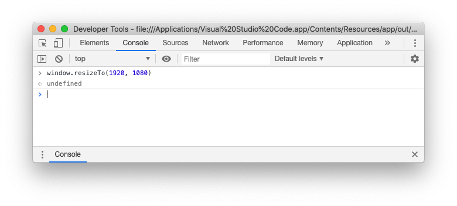
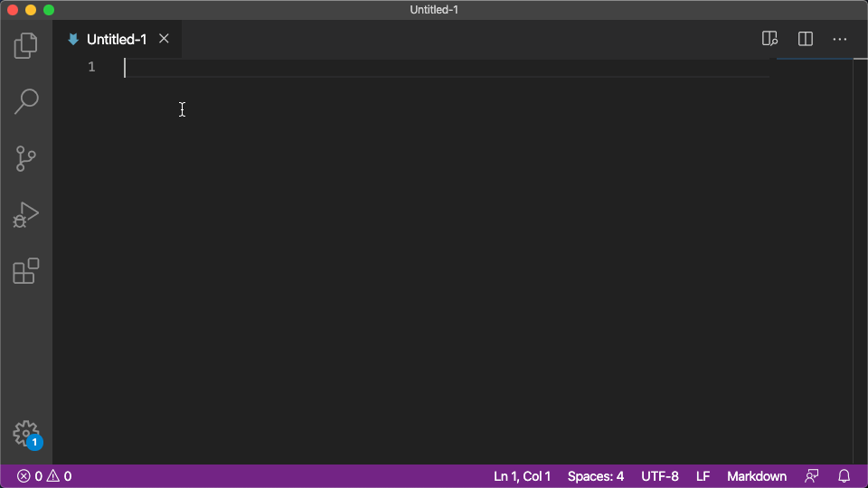

As many of us are spending more time these days recording development screencasts, I thought I would share a few simple tips to improve your recordings of [VS Code](https://code.visualstudio.com/?WT.mc_id=sinedied-github-yolasors), whether it's for making videos or GIFs.

## 1. Set pixel-perfect window size

I struggled a bit with this one problem, before finding an acceptable solution:

> How to resize VS Code window to a given pixel size?

When I record a 1080p video, I want my VS Code window to have **exactly** a size of 1920x1080 pixels for perfect rendering. I know that some premium third-party apps can resize any app window, but I wanted a way to do it that works all the time, regardless of my current monitor setup and OS (I frequently switch between Mac OS and Windows).

Turns out VS Code extensions can't do that, as they have access to neither the Electron nor DOM API. But you can use the Developer Tools directly:

- Open the command palette with `Ctrl+Shift+P` (Windows/Linux) or `Cmd+Shift+P` (Mac)
- Search for `Toggle Developer Tools`, then press `Enter`.
- In the Chrome Developer Tools window that will show up, select the **Console** tab and enter this code `window.resize(1920, 1080)`:

This will perfectly resize your current VS Code window to the size you chose 🎉.

## 2. Enable screencast mode

Did you know that VS Code can highlight your mouse clicks and show the keys being pressed? There's a built-in feature called **Screencast Mode** that allows you to do that, so your viewers can more easily follow what you're doing. To enable Screencast Mode:

- Open command palette with `Ctrl+Shift+P` (Windows/Linux) or `Cmd+Shift+P` (Mac)
- Search for `Toggle Screencast Mode`, then press `Enter` to activate

With this mode enabled, every mouse click will become circled in red and keystrokes will be shown as an overlay, like that:

You might then think that showing ***every*** keystroke will become quickly tiring, but thankfully there's a setting for that:

- Open user settings with `Ctrl+,` (Windows/Linux) or `Cmd+,` (Mac)
- Search for `Screencast Mode`
- Click on `Only show keyboard shortcuts in Screencast Mode` checkbox

Now only shortcuts will appear as an overlay, neat! 😎

## 3. Zoom in

This one might seem trivial but is very often overlooked. I know that when developing, having as much screen estate as possible is important. But for your viewers, readability is even more important, and you should definitely try to zoom in as much as possible your editor window.

Your viewers may use small screens like smartphones, use small windows if they are multitasking or simply having a bad internet connection, forcing them to have a low resolution with compression artifacts. For all these reasons, the more you zoom in, the happier your viewers will be:

- Use `Ctrl+=` and `Ctrl+-` (Windows/Linux) or `Cmd+=` and `Cmd+-` (Mac) to zoom in/out

#### Bonus: Make GIFs

If you're searching for good GIFs recording tools, my favorite ones are [LICECap](https://www.cockos.com/licecap/) on Windows/Mac and [Peek](https://github.com/phw/peek) on Linux, both free to use.

That's it for my personal tips, but if you know other useful tips for video recording share it in the comments!

---

Follow me on [Twitter](http://twitter.com/sinedied), I would be happy to discuss and take your suggestions!
